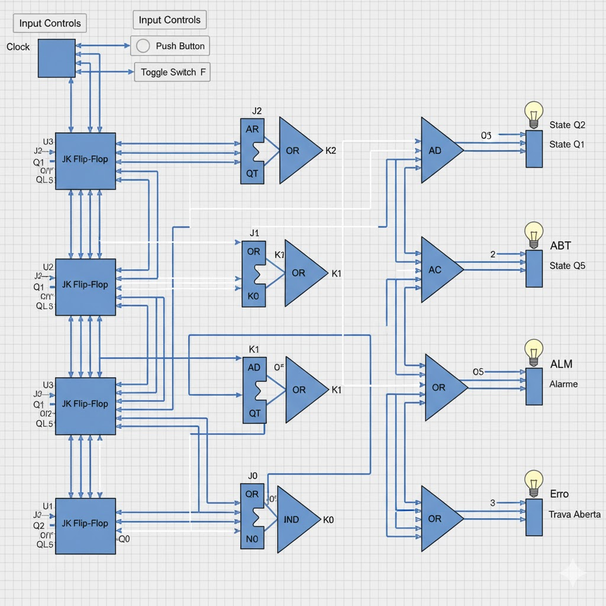
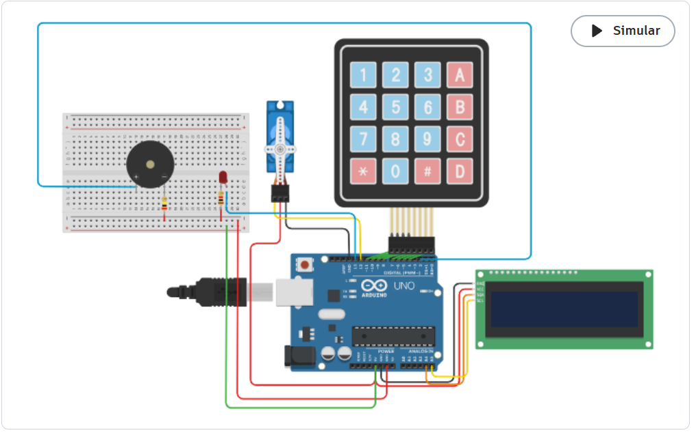

# Digital Safe Security System: Sequential Logic & Hardware Design

This project implements a hardware-level digital security lock system using fundamental concepts of Digital Systems, Boolean Algebra, and Microcontroller integration.

## Project Overview
The objective was to design a security mechanism that only grants access ("Unlock") when a specific bit sequence is entered correctly. This project demonstrates the practical application of both combinational and sequential logic, moving from theoretical gate design to a functional Arduino prototype.

## Technical Implementation

### 1. Sequential Logic & State Management
**Memory Elements:** Implemented **JK Flip-Flops** to create a memory state, allowing the system to "remember" the sequence of inputs over time.
**Logic Gates:** Used **AND, OR, and NOT gates** to build the decoding circuitry that validates the user input against the hardcoded sequence.
**Finite State Machine (FSM):** The circuit transitions through specific states (Locked, Correct Step, Unlocked) based on the clock-driven synchronization of the Flip-Flops.

### 2. Hardware Prototype (Arduino)
**Processing:** An **Arduino Uno** serves as the central controller, managing the keypad inputs and executing the logic to trigger the outputs.
**Peripheral Integration:** Includes a **4x4 Matrix Keypad** for user input, an **I2C LCD Display** for status feedback, and a **Servo Motor** for the physical locking mechanism.
**Indicators:** Features a Piezo buzzer and LEDs for auditory and visual alerts during access attempts.

## Circuit Visualization

### Logic Circuit Design (The "Brain")

*Detailed view of the JK Flip-Flop architecture and logic gates designed to handle sequence validation.*

### Hardware Implementation

*The complete Tinkercad simulation showing the Arduino Uno integrated with the keypad, servo, and LCD display.*

## Tools Used
**Logic.ly:** For high-level digital logic design and validation.
**Tinkercad:** For hardware prototyping and Arduino C++ simulation.
**Boolean Algebra:** Applied for logic minimization to optimize the gate count and circuit efficiency.

## Key Learning Outcomes
Proficiency in **sequential logic** and clock-driven synchronization.
Practical experience in interfacing microcontrollers with matrix inputs and analog/digital outputs.
Mastery of state transitions and hardware-level security logic.
